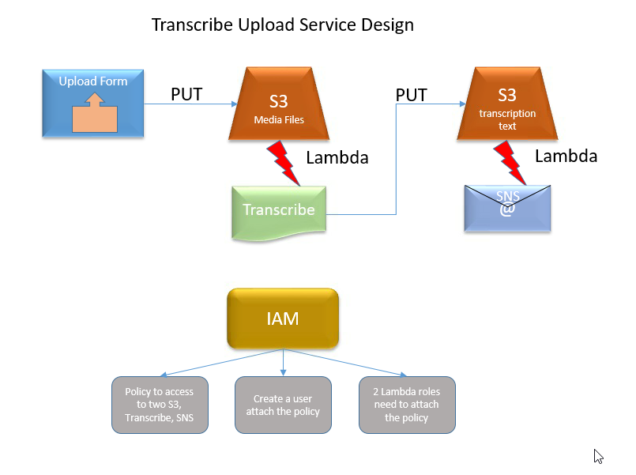

# Simple AWS Transcribe

Show a simple way how to get the transcription text in email from an upload the an audio or video file. 

**Process**

The audio file will be automatically pushed to the Transcribe service by S3 event to a Lamda function that will start the transcribe job. The Transcribe service will start a job to create transcription text for the audio file. Then it pushed the transcription text file to S3. The email will be sent out by S3 event to a Lamda function that creates a message and publish to SNS. 

### Goals

**IAM**

1. Create a Policy in AWS
2. Create a User in AWS and attach to the Policy
3. Create Lambda Roles and attach to the Policy

**S3**

1. Create buckets
2. CORS Setup
3. Event to a Lambda function

**Lambda**

1. Create a Lambda function
2. Handle a S3 Event
3. Test
4. Pulish
5. Understand a Lamda function Role

**SNS**

1. Create a Topic
2. Create Subcribers in the Subscription

**Transcribe**

1. Create a Transcribe Job
2. Configuration (destinations)

